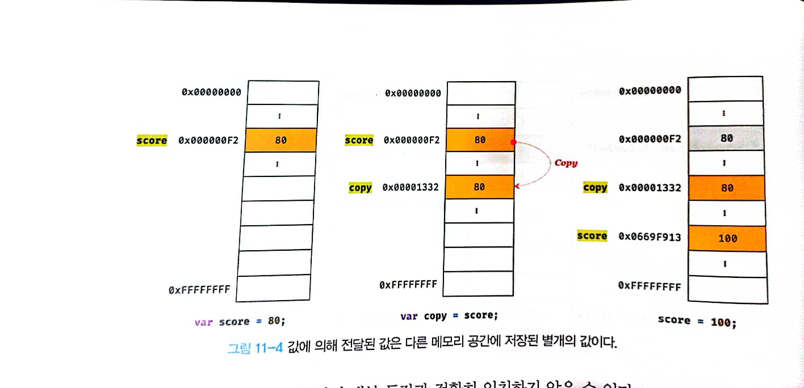
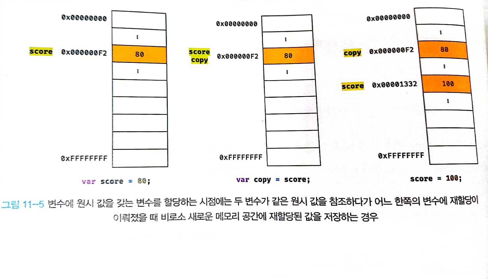
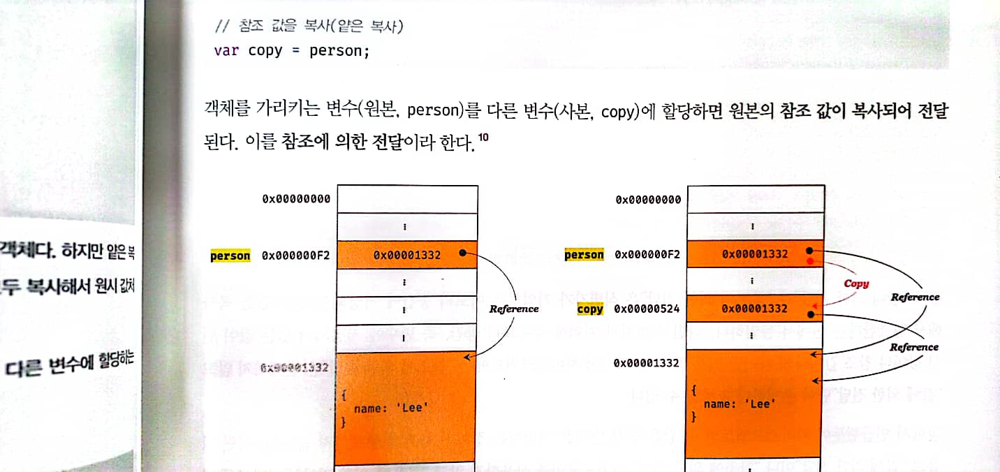

## 1. 원시값과 객체값의 차이

-   원시 값은 변경 불가능(immutable), 객체 값은 변경 가능(mutable)
-   원시 값을 변수에 할당하면 변수는 실제 데이터를 가리킨다.
    하지만 객체 값을 변수에 할당하면 변수는 데이터의 주소를 가리킨다.
-   원시 값: Call by Value
    객체 값: Call by Reference

## 2. 원시 값

1. 원시 값은 변경 불가능
    - 변수: 값을 저장한 메모리를 가리키는 이름표 딱지
    - 값: 메모리에 저장된 실제 데이터
    - 변경 불가능 한 것은 값 그 자체지 변수가 아니다.
    * 재할당: 이름표 딱지가 가리키는 대상을 바꾸는 것
2. 문자열과 불변성

    - JS에서는 문자열도 원시값이므로 재할당해도 가리키는 대상만 바뀐다.
    - 유사 배열 객체이므로 인덱스로 프로퍼티 값에 접근할 수 있고, length 프로퍼티를 갖는다.

    ```jsx
    let str = "string";

    console.log[str[0]]; //s

    console.log(str.length); //6
    str[0] = "S"; //문자열도 원시값이므로 값을 변경할 수 없다.
    console.log(str); //string
    ```

## 3. Call by Value

-   변수에 원시 값을 갖는 변수를 할당하면 할당받는 변수에는 할당되는 변수의 값만 복사되어 전달된다.

```jsx
let score = 80;

let copy = score;

console.log(score, copy);80 80
console.log(score === copy);//true

score = 100;

console.log(score, copy);// 100 80
console.log(score === copy);//false
```



-   이렇게 원시 값을 갖는 변수를 할당하는 즉시 값이 복사될 수도 있고,
    
-   이렇게 원시 값을 갖는 변수를 할당한 시점에는 두 변수가 같은 주소를 가리키다가 어느 한쪽에 값을 재할당하면 가리키는 주소가 달라질 수도 있다.
-   어느쪽이든 결국 변수에 원시 값을 갖는 변수를 할당하면, 두 변수의 원시 값은 서로 다른 메모리 장소에 저장되므로 서로 간섭할 수 없다.

## 4. 객체

1. 객체의 특징

-   프로퍼티의 개수가 정해져있지 않으므로 동적으로 추가되고 삭제할 수 있다.
-   프로퍼티의 데이터 타입도 제약이 없다. -> 확보해야 할 메모리 크기를 사전에 알 수 없다.

2. Mutable Value

-   원시 값을 할당받은 변수는 값이 들어있는 메모리 주소를 직접 가리킨다.
-   그러나 객체를 할당받은 변수가 가리키는 메모리 주소로 가면 또 다른 메모리 주소가 있다. 따라서 객체는 변경될 수 있다.

*   또한, 여러 식별자가 하나의 객체를 공유할 수 있다.

```jsx
let person = {
    name: "Lee",
};
person.name = "Kim";
person.address = "Seoul";
console.log(person); //{name: "Kim", address: "Seoul"}
```

## 5. Call by Reference

```jsx
let person = {
    name: "Lee",
};

let copy = person; //person에 저장된 주소가 copy로 복사된다. 따라서 person과 copy는 같은 객체를 가리킨다.
```


