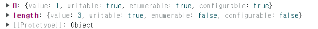

## 1. 배열이란?

1. JS의 모든 값은 배열의 요소가 될 수 있다. 여기에는 객체, 함수 등도 포함된다.
2. 당연히 index는 0부터 시작된다.
3. 배열에는 길이를 나타내는 length 프로퍼티가 있다.
4. 배열은 객체 타입이다.
5. 일반적인 객체와는 달리 배열의 값들은 순서가 있다.

## 2. 일반 배열 VS. JS 배열

1. 일반 배열

    - 동일한 크기의 메모리 공간(따라서 데이터 타입이 동일함)이 빈틈없이 연속적으로 나열되어 있다. (밀집 배열)
    - 임의 요소에 접근방법
        - 정렬된 배열(요소의 index를 알고 있음)
            - 대상 메모리 주소 = 배열의 시작 메모리 주소 + index \* 요소의 바이트 수
            - 예: 시작 주소: 1000, index 숫자는 2(3번째 요소), 데이터 타입: int(4바이트)
            - 메모리 주소 = 1000 + 2 \* 4 = 1008
            * 시간복잡도: O(1)
        * 정렬되지 않은 배열(요소의 index를 모름)
            - 배열의 모든 요소를 다 찾아야 한다
            - 시간복잡도: O(n)

    * 삽입 및 삭제 시 배열의 모든 요소를 전부 한칸씩 이동시켜야 한다.

2. JS 배열(연결리스트?)
    ```jsx
    console.log(Object.getOwnPropertyDescriptors([1, 2, 3]));
    /*
    0: {value: 1, writable: true, enumerable: true, configurable: true}
    1: {value: 2, writable: true, enumerable: true, configurable: true}
    2: {value: 3, writable: true, enumerable: true, configurable: true}
    length: {value: 3, writable: true, enumerable: false, configurable: false}
    [[Prototype]]: Object
    */
    ```
    - 위와 같이 JS의 배열에서 index는 property key이고 배열의 값은 property value이다.
    - 요소 접근은 비교적 느리지만 삽입과 삭제는 비교적 빠르다.
    - 일반적인 객체보다 검색 속도가 2배정도 더 빠르다.

## 3. length property와 희소 배열

1. length property

    - 빈 배열이면 0이고, 아니면 가장 큰 index + 1이다.
    - 배열에 요소를 추가하거나 삭제하면 자동으로 갱신된다.
    - 임의 할당

        - 더 작은 숫자 할당: 배열이 줄어들면서 뒤의 값이 삭제된다.

        ```jsx
        const arr = [1, 2, 3, 4, 5];

        arr.length = 3;
        console.log(arr); //[1, 2, 3]
        ```

        - 더 큰 숫자 할당: length property 값은 변경되지만 empty는 실제로 추가된 배열의 요소가 아니므로 arr[1]과 arr[2]에는 값이 존재하지 않는다.

        ```jsx
        const arr = [1];
        arr.length = 3;
        console.log(arr.length);
        console.log(arr); //(3) [1, empty × 2]
        console.log(Object.getOwnPropertyDescriptors(arr));
        ```

        

2. 희소 배열: 배열의 요소가 연속적으로 위치하지 않고 일부가 비어 있는 배열([, 2, , 4] 이런 거)

-   JS에서는 허용되기는 하지만 가급적 만들면 안된다.

## 4. 배열 생성

1. 배열 리터럴

```jsx
const arr = [1, 2, 3];
```

2. Array 생성자 함수

-   전달된 인수가 1개이고 숫자: length property 값이 인수인 배열 생성
    -   생성된 배열은 희소 배열로 배열의 요소가 없다.
    -   RangeError: 인수가 0~2<sup>32</sup> - 1 범위를 벗어나면 발생한다.
    ```jsx
    const arr = new Array(10);
    console.log(arr); //[empty × 10]
    console.log(arr.length); //10
    ```
-   전달된 인수가 없으면 빈 배열 생성

*   전달된 인수가 2개 이상이거나 숫자가 아닌 경우 인수를 요소로 갖는 배열 생성
    ```jsx
    new Array(1, 2, 3); //[1, 2, 3]
    new Array({}); //[{}]
    ```
*   Array 생성자 함수 내부에서 new.target을 확인하므로 new 연산자와 함께 호출하지 않아도 된다.
    ```jsx
    Array(1, 2, 3);
    ```

3. Array.of 생성자 함수(ES6)

-   전달된 인수를 요소로 갖는 배열을 생성한다.
    ```jsx
    Array.of(1); //[1]
    Array.of(1, 2, 3); //[1, 2, 3]
    Array.of("string"); //['string']
    ```

4. Array.from 생성자 함수(ES6)
    ```jsx
    //유사 배열 객체를 변환하여 배열을 생성한다.
    Array.from({ length: 2, 0: "a", 1: "b" }); //(2) ['a', 'b']
    //이터러블을 변환하여 배열을 생성한다. 문자열은 이터러블이고, 이터러블은 요소를 하나하나 쪼개서 배열로 만든다.
    Array.from("Hello"); //(5) ['H', 'e', 'l', 'l', 'o']
    ```
    - 두번째 인수???

## 5. 배열 요소의 참조

-   존재하지 않는 요소를 참조하면 undefined를 반환한다.

## 6. 추가와 갱신

-   존재하지 않는 인덱스를 사용해 값을 할당하면 새로운 요소가 추가된다. (오류가 안 난다!!)
    ```jsx
    const arr = [0];
    arr[1] = 1;
    console.log(arr);
    console.log(arr.length);
    ```
-   length property보다 큰 값을 인덱스로 쓰면 희소 배열이 만들어진다.
-   정수 이외의 값을 인덱스로 사용하면 프로퍼티가 생성된다. 이 때 추가된 프로퍼티는 length에 영향을 미치지 않는다.
    ```jsx
    const arr = [];
    arr["foo"] = 3;
    console.log(arr.length); //0
    ```

## 7. 배열의 삭제

-   배열도 객체이므로 delete 연산자로 요소 삭제가 가능하지만 delete는 자리 이동을 해주지 않으므로 splice 메서드를 사용해야 한다.

## 8. 배열의 메서드

1. 결과물 반환 패턴
    - mutator method: 원본 배열을 직접 변경(사용 자제)
    - accesor method: 새로운 배열을 생성하여 반환
2. 메서드의 종류

    1. Array.isArray(): 전달된 인수가 배열이면 True, 아니면 False

    ```jsx
    Array.isArray([]);
    Array.isArray(null);
    ```

    2. Array.prototype.indexOf()
        - 원본 배열에서 인수로 전달된 요소를 검색하여 인덱스를 반환한다. 인수가 없으면 -1을 반환한다.

    ```jsx
    const arr = [1, 2, 3, 4];
    arr.indexOf(2); //1
    ```

    3. Array.prototype.push()
        - 인수로 전달받은 모든 값을 **원본 배열**의 마지막 요소로 추가하고 변경된 length 프로퍼티 값(배열의 길이)를 반환한다.
        - 원본 배열을 직접 변경하므로 이거 대신 스프레드 문법을 쓰는 편이 낫다.
        ```jsx
        const arr = [1, 2];
        let result = arr.push(3, 4);
        console.log(result); //4
        console.log(arr);
        [1, 2, 3, 4];
        ```
    4. Array.prototype.pop()
        - **원본 배열**의 마지막 요소를 제거하고 제거한 값을 반환한다.
        - 원본 배열이 빈 배열이면 undefined를 반환한다.
        - push와 pop 메서드로 스택을 구현할 수 있다.
    5. Array.prototype.unshift
        - 인수로 전달받은 모든 값을 **원본 배열**의 선두에 추가하고 늘어난 length 프로퍼티 값을 반환한다.
        - 선두에 두는 거 빼고는 push랑 동일
    6. Array.prototype.shift
        - **원본 배열**의 첫번째 요소를 제거하고 반환한다. 첫번째 요소라는 걸 제외하면 pop과 동일하다.
        - push와 shift로 큐를 구현할 수 있다.
    7. Array.prototype.concat

        - 인수로 전달된 값들(배열 혹은 원시값)을 원본 배열의 마지막 요소로 추가한 다음, **새로운 배열**을 반환한다.
        - 인수로 전달된 값이 배열이면 그 배열은 해체한다.
        - 스프레드 문법으로 대체할 수 있다.

        ```jsx
        const arr1 = [1, 2];
        const arr2 = [3, 4];

        let result = arr1.concat(arr2);
        console.log(result); //[1, 2, 3, 4]
        console.log(arr1); //[1, 2]
        let result2 = [5, 6].concat(arr2); //push나 unshift는 이렇게 표현식에 배열을 직접 적을 수 없다.
        console.log(result2);
        let result3 = result.concat(7, 8);
        console.log(result3); //[1, 2, 3 , 4, 7, 8]
        ```

    8. Array.prototype.splice(start, deleteCount, items)
        - 배열 중간에 요소를 추가하거나 중간의 요소를 제거한다.
        - **원본 배열**을 직접 변경한다.
        - 제거한 요소를 결과로 반환한다.
        - start: 원본 배열의 요소를 제거하기 시작할 인덱스를 나타낸다.
            - start만 지정하면 원본 배열의 모든 요소를 제거한다.
            - start가 음수면 배열의 끝에서부터 나타낸다. 끝에서 첫번째 요소의 인덱스는 -1이다.
        - deleteCount: start부터 제거할 요소의 개수. 0이면 아무 것도 제거되지 않는다. 생략하면 start부터 모든 요소를 제거한다.
        - items: 제거한 위치에 삽입할 요소들의 목록이다.
    9. Array.prototype.slice(start, end)

        - 인수로 전달된 범위의 요소들을 복사하여 배열로 반환한다.
        - 원본 배열을 변경하지 않는다.

        ```jsx
        const arr = [1, 2, 3];

        arr.slice(1, 2); //[2], 인덱스가 2인 요소는 포함하지 않는다.
        ```

    10. Array.prototype.join(구분자)

        - 원본 배열의 모든 요소를 문자열로 변환 후, 인수로 전달받은 문자열로 연결하여 반환한다.
        - 인수 생략 시 ,로 구분한다.

        ```jsx
        const arr = [1, 2, 3, 4];

        console.log(arr.join());
        console.log(arr); //원본 배열은 그대로
        ```

    11. Array.prototype.reverse()
        - 원본 배열의 순서를 뒤집는다. **원본 배열**을 변경한다.
    12. Array.prototype.fill()
        - 원본 배열을 인수로 전달받은 값으로 채운다. **원본 배열**을 변경한다.
        * 인수
            - 첫번째 인수: 채울 값
            - 두번째 인수: 채우기를 시작할 인덱스
            - 세번째 인수: 채우기를 끝낼 인덱스
        * 콜백 함수 내용: ???
    13. Array.prototype.include
        - 배열 내에 특정 요소가 포함되어 있는지 검색해서 True나 False를 반환한다.
        - 인수
            - 첫번째: 검색할 요소
            - 두번째: 검색을 시작할 인덱스
    14. Array.prototype.flat()
        - 인수로 전달한 깊이만큼 배열을 평탄화한다. 인수로 Infinity를 전달하면 중첩 배열 모두를 평탄화한다.

## 9. 배열의 고차 함수

1. 고차 함수: 함수를 인수로 전달받거나 함수를 반환하는 함수
2. 배열의 고차 함수

    1. Array.prototype.sort

        - **원본 배열**의 요소를 정렬. 기본적ㅇ으로 오름차순
        - 한글도 정렬 가능
        - 내림차순: sort 사용 후 reverse 사용

        ```jsx
        const fruits = ["Banana", "Orange", "Apple"];
        fruits.sort();
        fruits.reverse();
        console.log(fruits);
        ```

        - 숫자가 요소이면 의도대로 정렬되지 않는다. 인수를 받지 않으면 숫자 요소도 일시적으로 문자열로 변환한 후, 유니코드 코드 포인트 순서를 기준으로 정렬하기 때문이다.
        - 따라서 정렬 순서를 정의하는 비교함수를 인수로 전달해야 한다.
            - 비교 함수의 값이 0미만이면 비교 함수의 첫번째 인수가 앞에 가게 정렬한다.
            - 비교 함수의 값이 0 이상이면 비교 함수의 두번째 인수가 앞에 가게 정렬한다.
            - 비교 함수의 값이 0이면 아무 것도 하지 않는다.

        ```jsx
        const points = [40, 100, 1, 5, 2, 25, 10];

        points.sort((a, b) => a - b); //오름차순
        console.log(points);

        points.sort((a, b) => b - a); //내림차순
        console.log(points);
        ```

        - 배열의 요소가 객체일 때 정렬하는 방법
          [Code](Chapter27Code_objSort.js)
