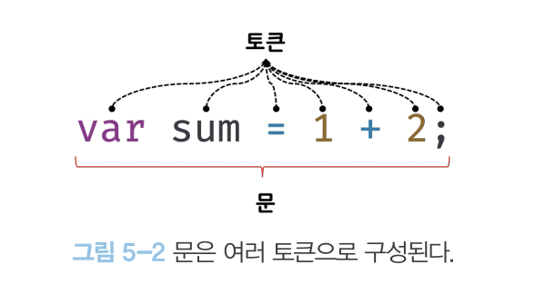

5. 표현식과 문

5)-1. 값
값은 식이 평가 되어 생성된 결과
평가란 식을 해석해서 값을 생성하거나 참조하는 것

```javascript
//10 + 20은 평가되어 숫자 값 30을 생성한다
10 + 10;
```

모든 값은 데어티 타입을 가지며, 메모리에 2진수 즉 비트의 나열로 저장된다. 메모리에 저장된 값은 데이터 타입에 따라
다르게 해석 될 수 있다.
0100 0001 숫자 -> 65, 문자 -> 'A'

변수는 하나의 값을 저장하기 위해 확보한 메모리 공간 자체 또는 그 메모리 공간을 식별하기 위해 붙인 이름이라고 했다.
따라서 변수에 할당 되는 것은 값이다

```javascript
var sum = 10 + 20;
```

위 예제에서 sum에 할당되는 것은 10 + 20이 아니라 30이다.
따라서 10 + 20 은 할당 이전에 평가되어 값을 생성해야한다

5)-2

**리터럴** 은 사람이 이해할 수 있는 문자 또는 약속된 기호를 사용해 값을 생성하는 표기법을 말한다

```javascript
//숫자리터럴 3
3;
```

위 예제의 3은 단순한 아라비아 숫자가 아니라 숫자 리터럴이다.


이처럼 리터럴은 사람이 이해할 수 있는 문자 또는 미리 약속된 기호 등으로 표기한 코드다.

| 리터럴             | 예시                            | 비고                    |
| ------------------ | ------------------------------- | ----------------------- |
| 정수리터럴         | 100                             |                         |
| 부동소수점 리터럴  | 10.5                            |                         |
| 2진수리터럴        | 0b010000001                     | 0b로 시작               |
| 8진수 리터럴       | 0o101                           | ES6에서 도입. 0o로 시작 |
| 16진수 리터럴      | 0x41                            | ES6에서 도입. 0x로 시작 |
| 문자열 리터럴      | 'hello' "wolrd"                 |                         |
| 불리언 리터럴      | True False                      |                         |
| null리터럴         | null                            |                         |
| undefined리터럴    | undefined                       |                         |
| 객체리터럴         | {name: 'lee', address: 'seoul'} |                         |
| 배열 리터럴        | [1, 2, 3]                       |                         |
| 함수리터럴         | function(){}                    |                         |
| 정규 표현식 리터럴 | /[a-z] +/ g                     |                         |

5)-3 표현식

표현식은 값으로 평가될 수 있는 문이다. 즉 표현식이 평가되면 새로운 값을 생성하거나 기존 값을 참조한다.
따라서 리터럴도 표현식이다

```javascript
var score = 100;
```

위 예제의 100은 리터럴이다 리터럴은 자바스크립트 엔진에 의해 평가되어 값을 생성하므로 리터럴은 그 자체로 표현식이다.

즉 값으로 평가될 수 있는 문은 모두 표현식이다

```javascript
//리터럴 표현식
10;
("hello");

//식별자 표현식 (선언이 이미 존재한다고 가정)
sum;
person.name;
arr[1];

//연산자 표현식
10 + 20;
sum = 10;
sum !== 10;

//함수/매서드 호출 표현식(선언이 이미 존재한다고 가정)
square();
person.getName();
```

표현식과 표현식이 평가된 값은 동등한 관계 즉 동차다.
1+2=3이라면 1+2와 3은 동차(같다)라고 할 수 있다

5)-4 문
문은 프로그램을 구성하는 기본 단위 이자 최소 실행단위다.
문의 집합으로 이루어진 것이 바로 프로그램이며, 문을 작성하고 순서의 맞게 나열하는 것이 프로그래밍이다.

문은 여러 토큰으로 구성된다
토큰이란 문법적인 의미를 가지며, 문법적으로 더 이상 나눌 수 없는 코드의 기본요소를 의미한다.
예를 들어, 키워드, 식별자, 연산자, 리터럴, 세미콜론... 등의 특수 기호는 문법적인
의미를 가지며, 문법적으로 더 이상 나눌 수 없는 코드의 기본 요소이므로 모두 토큰이다.


문을 명령문이라고도 부른다. 즉 문은 컴퓨터에 내리는 명령이다.

문은 선언문, 할당문, 조건문, 반복문 등으로 구분할 수 있다. 변수 선언문을 실행하면 변수가 선언되고, 할당문을 실해하면 값이 할당된다

5)-5 세미콜론과 세미콜론 자동삽입 기능
세미콜론(;)은 몬의 종료를 나타낸다.
단, 0개 이상의 문을 중괄호를 묶은 코드 블록 뒤에는 세미콜론을 붙이지 않는다.
예를 들어 if문 for 문 함수등의 코드 블록 뒤에는 세미콜론을 붙이지 않는다.
이러한 코드 블록은 언제나 문의 종료를 의미하는 자체 종결성을 갖기 때문이다

5)-6 표현식인 문과 표현식이 아닌문

표현식은 문의 일부일 수도 있고 그 자체로 문이 될 수 이싿

```javascript
//변수 선언문은값으로 평가될 수 없으므로 표현식이 아니다
var x;
//1, 1+ 2, 2, x, 1+2 는 모두 표현식이다
//x = 1 + 2 는 표현식이면서 완전한 문이기도 한다

x = 1 + 2;
```

표현식이 아닌 문은 값으로 평가될 수 없는 문을 말한다
예를 들면 변수 선언문은 값으로 평가될 수 없다. 따라서 표혁식이 아닌 문이다
하지만 할당 문은 값으로 평가 될 수 있다 따라서 표현식이 문이다.

표현식인 문과 표현식이 아닌 문을 구별하는 가장 간단하고 명료한 방법은 변수에 할당해 보는 것이다. 표형식인 문은 값으로 평가 되므로 변수의 할당할 수 있다.
하지만 표현식이 아닌 값은 문으로 평가 할 수 없으므로 변수에 할당하면 에러가 발생한다.

```javascript
//표현식이 아닌 문은 값처럼 사용할 수 없다.
var foo = var x; // SyntaxError : Unexpected token var
```

.따라서 변수 선언문은 값처럼 사용할 수 없음

```javascript
//표현식인 문은 갑처럼 사용할 수 없다
var foo = (x = 100);
console.log(foo); //100
```

완료값

        크롬개발자 도구에서 표형식이 아닌 문을 실행하면 언제나 undefined를 출력한다. 이를 완료 값이라고 한다. 완료 값은 표형식의 평가 결과가 아니다. 따라서 다른값과 같이 변수에 할당 할 수 없고 참조할 수 없다.
